# Dans ce tutoriel, vous apprendez a installer une machine virtuelle grâce au programme Virtualbox.

## Introduction : 
### *Tout d'abord, qu'est ce qu'une machine virtuelle et à quoi peut-elle nous servir?*
### Une machine virtuelle est un ordinateur complètement virtualisé qui se crée avec ce qu'on appelle un hyperviseur (ici ce sera VirtualBox). Cela peut servir à de nombreuses choses : Tout d'abord elle permet d'utiliser plusieurs systèmes d'exploitations différents en même temps et sur une même machine. Mais surtout, une machine virtuelle est très utile pour pouvoir tester des commandes ou des actions sans endommager notre machine principale. On pourra, par exemple, sauvegarder l'état de notre machine virtuelle pour pouvoir à tout moment récupérer les données perdues et réessayer divers actions si elles échouent.
---
## Pré-requis : 
### Nous devons donc télécharger un hyperviseur pour pouvoir utiliser et créer des machines virtuelles. Nous allons donc utiliser VirtualBox qui est quasiment compatible avec toutes les plateformes (Linux, Mac OS, Windows...).   

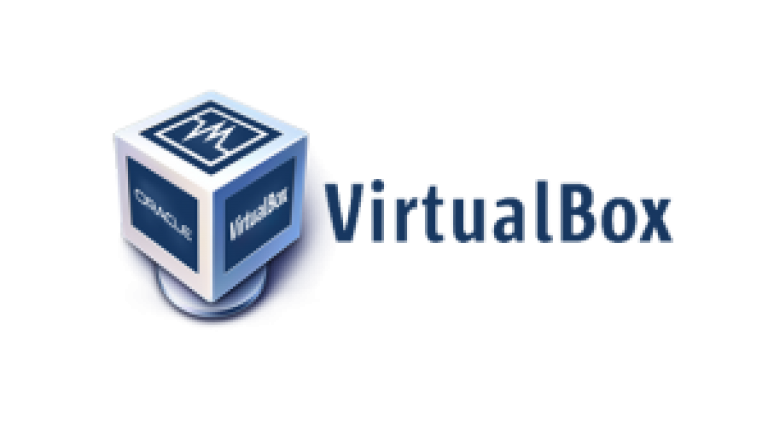
## [**Lien vers les téléchargements ( Toutes plateformes )**](https://www.virtualbox.org/wiki/Downloads)   
## Vous êtes à présent sur la page de téléchargements de VirtualBox. Vous devez ensuite choisir le téléchargement adéquat pour la plateforme que vous avez (Windows, Linux...)   
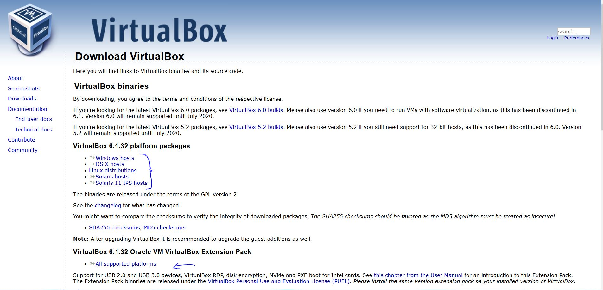

### **Très Important** : il faut également télécharger le pack d'extension appelé ***Oracle VM VirtualBox Extension Pack***, qui nous servira plus tard.

## Finalement, il vous faudra pour terminer, rentrer dans le Bios/UEFI de votre ordinateur et d'y activer l'option pour la Virtualisation.

## Pour accéder à votre Bios ou UEFI : https://lecrabeinfo.net/acceder-au-bios-ou-a-luefi-dun-ordinateur.html
### Exemple pour activer l'option de virtualisation : 
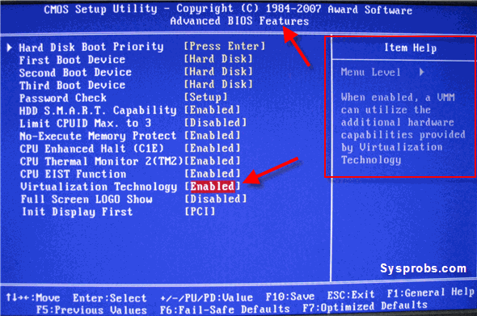

*Image tiré du site : https://www.tech2tech.fr/comment-activer-la-technologie-de-virtualisation-sur-mon-pc/*

-----

## Installation : 
### Lancez le programme que vous avez télécharger précédemment et l'installation devrait se passer normalement en suivant les instructions donné par les développeurs du programme.

### Vous devrez arriver sur cette interface lorsque tout est fini ( sans les barres bleues ) :
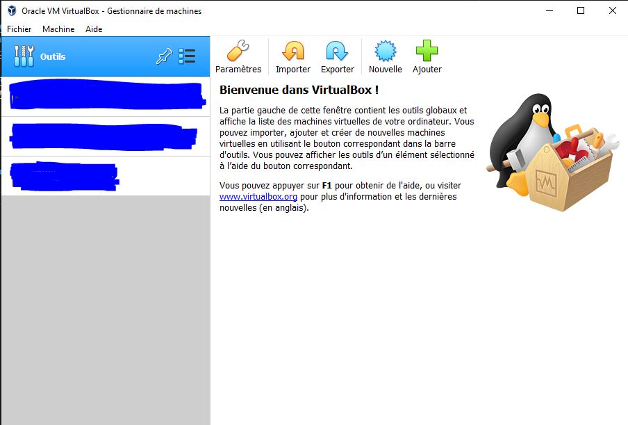

## Vous devez maintenant télécharger une image du système d'exploitation que vous voulez, en voici quelque uns :
* ## [macOS Catalina](https://apps.apple.com/fr/app/macos-catalina/id1466841314?mt=12)
* ## [Linux Mint](https://linuxmint.com/download.php)
* ## [Debian 11 Bullseye](https://www.debian.org/download)
* ## [Windows 10](https://www.microsoft.com/fr-fr/software-download/windows10)

## Une fois téléchargé, vous devriez avoir une image disque en **.iso**. Cependant avant tout cela, il faut installer sur le logiciel le pack d'extension précédemment télécharger :
* ## Etape 1 : Appuyez **en même temps** sur les touches CTRL et G
* ## Etape 2 : Une fois sur cette interface, appuyer sur la catégorie ***Extensions***
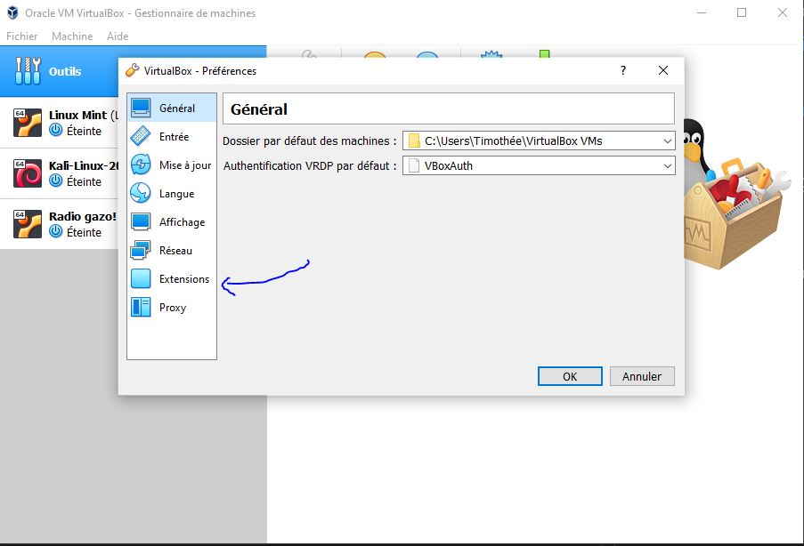
* ## Etape 3 : Appuyez sur le petit ***+*** vert
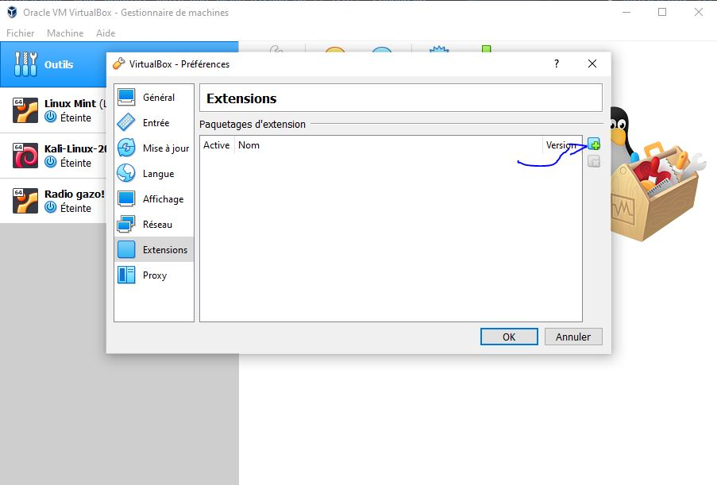
* ## Etape 4 : Choisissez le pack d'extension que vous avez télécharger et appuyez sur ***Ouvrir***
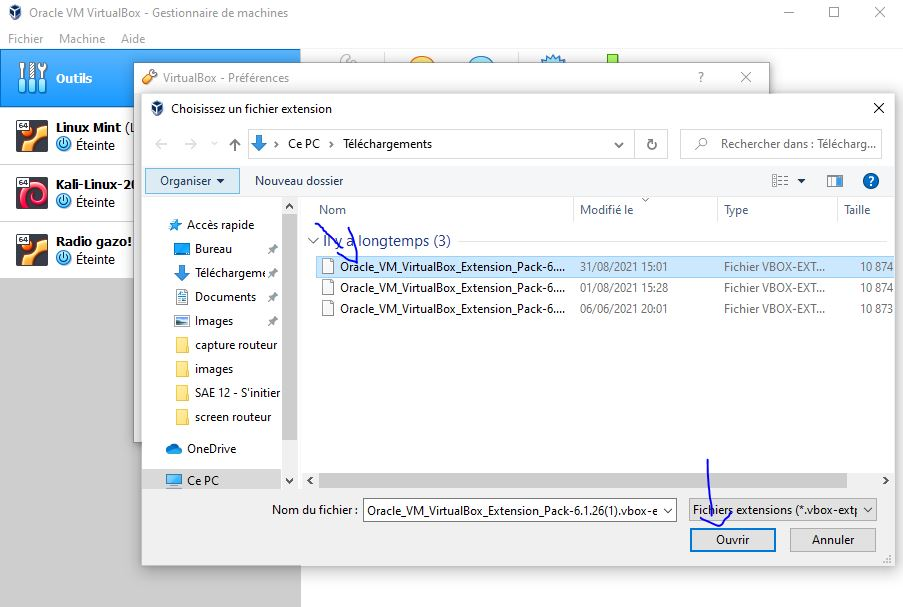
* ## Etape 5 : Appuyez sur ***Installation***
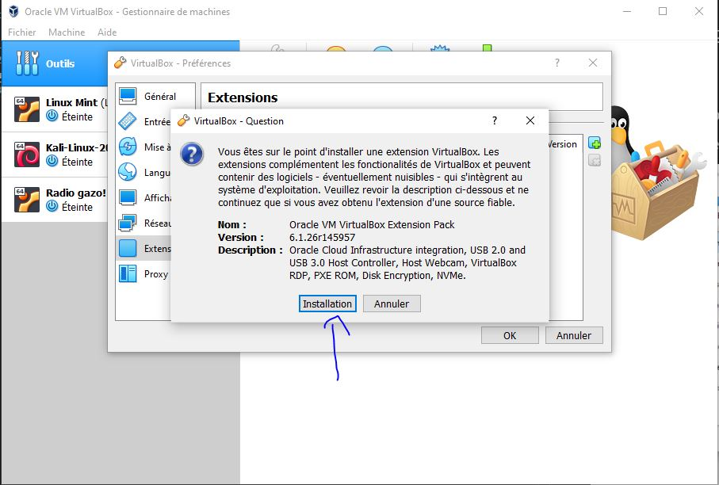

----

## Une fois cela fait, nous allons créer notre première machine virtuelle. Pour cela, il vous faut cliquer sur ***Nouvelle*** et d'y mettre le nom du système d'exploitation que vous allez installer, les paramètres devrait se mettre automatiquement et cliquez sur ***Suivant*** :
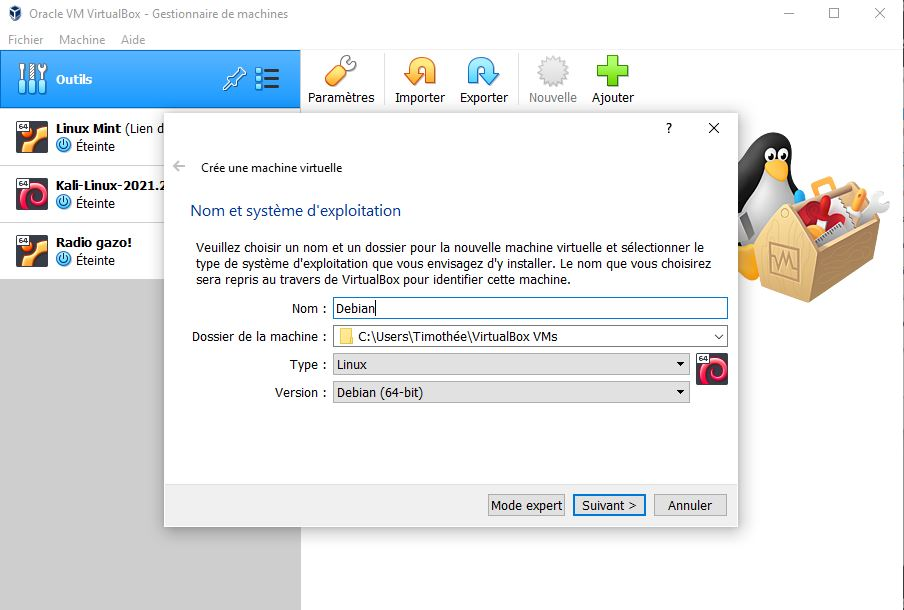
## Nous allons créer un disque dur virtuel pour le stockage de notre machine virtuelle :
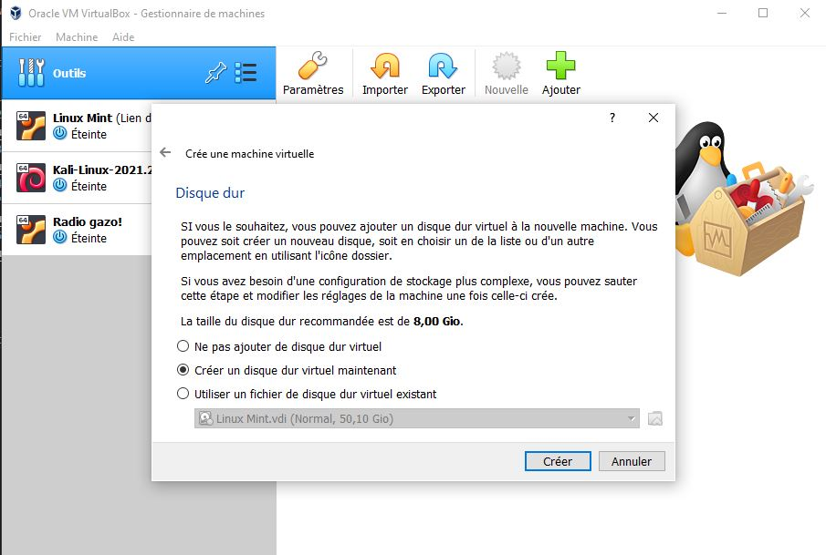
## Pour le disque dur, nous allons utiliser l'option Dynamiquement alloué pour ne pas prendre trop d'espace de stockage sur notre machine actuelle.
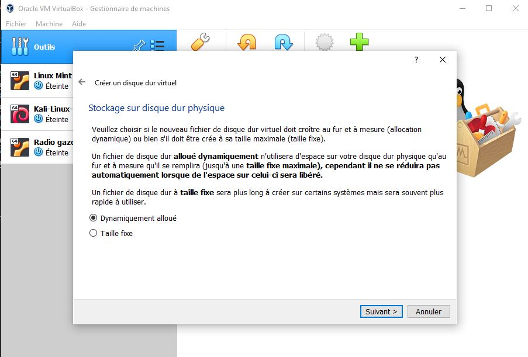
## Choisissez un chemin pour stocker votre machine ou laissez comme c'est par défaut et indiquez la taille que vous voulez allouer pour votre machine virtuelle (Il est préférable de prendre au **minimum** 30Gio) et appuyez sur ***Créer*** :
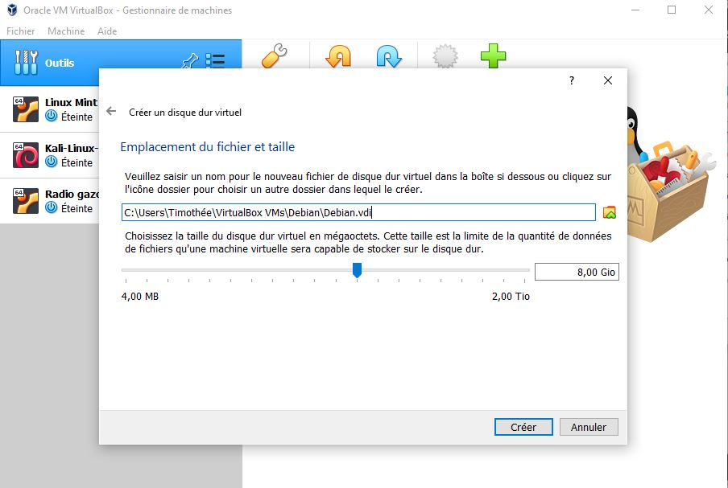
## Maintenant, en fonction des capacités de mémoire vive dont vous disposez, choisissez le nombre d'espace que vous souhaitez allouer pour le fonctionnement de votre machine virtuelle (Il est mieux de rester dans le vert mais d'en mettre quand même à minimat 4 Go) et cliquez sur ***Suivant*** :
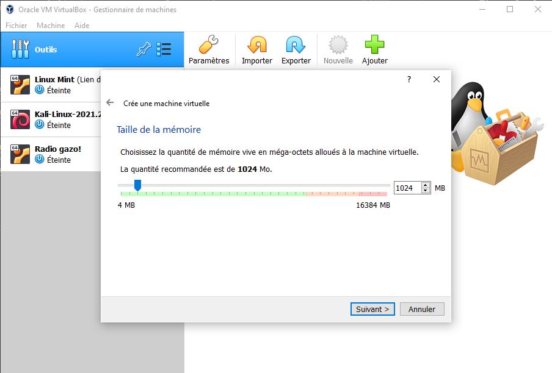
## A présent, sur l'interface principale, cliquez gauche sur votre machine puis cliquez sur l'onglet ***Configuration*** et allez dans ***Stockage*** puis cliquez sur l'icone du cd avec un + :
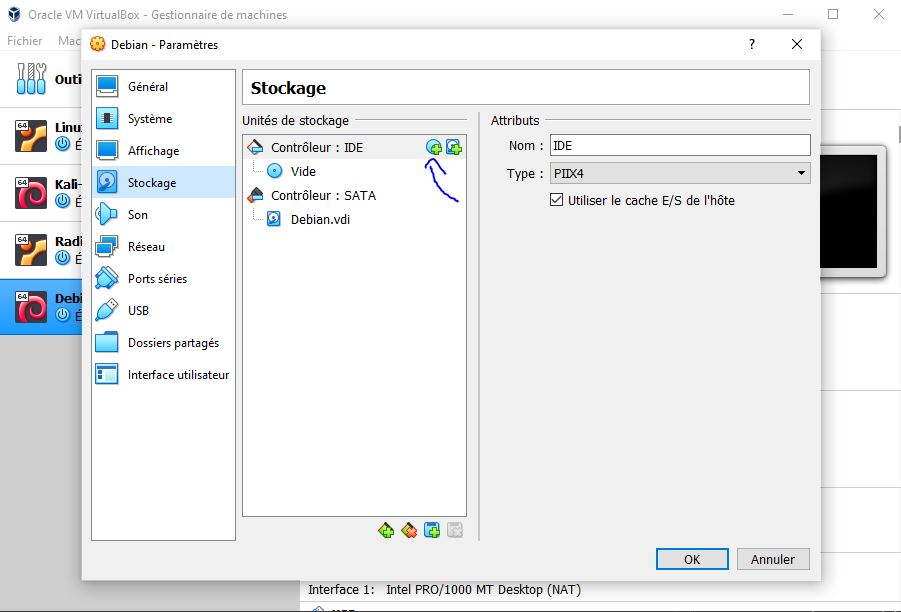
## Vous choisirez l'image que vous avez télécharger et vous irez appuyer sur ***Suivant***.
## Finalement, vous irez dans l'onglet ***USB*** et vous cocherez l'option ***USB 2.0*** ou bien ***USB 3.0*** à votre choix en fonction de vos composants :
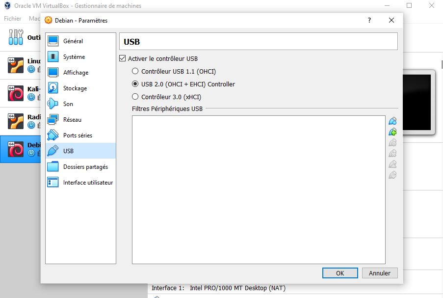
## Pour en finir avec la pré-configuration, appuyez maintenant sur la catégorie ***Réseau*** et choisissez en ***Mode d'accès réseau*** le mode ***Accès par pont*** : 
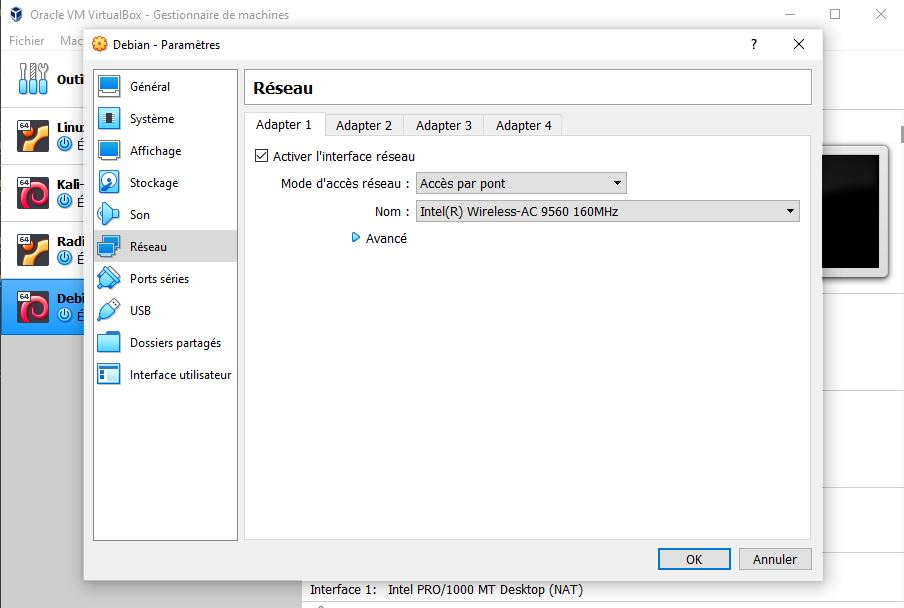
----
# Vous voilà maintenant avec votre première machine virtuelle ! Vous pouvez maintenant quitter l'onglet de configuration et double-cliquez sur la machine qui s'est créer, et vous voilà devant comme si vous aviez une véritable deuxième machine complètement autonome ! 
*Le guide ne prends pas en charge l'installation du système d'exploitation mais uniquement de la partie mise en place de la machine virtuelle. Cependant, vous pouvez trouver pour chaque systèmes d'exploitations des documentations détaillés sur les sites des développeurs/entreprises.*