 # Introduction : 
## Avant de commencer quoi que ce soit et de suivre le guide des différentes manipulations à effectuer pour résoudre un problème réseau, il est **primordial** de comprendre comment est construit le réseau de l'entreprise dans laquelle vous vous trouvez.

# Exemple de réseau : 
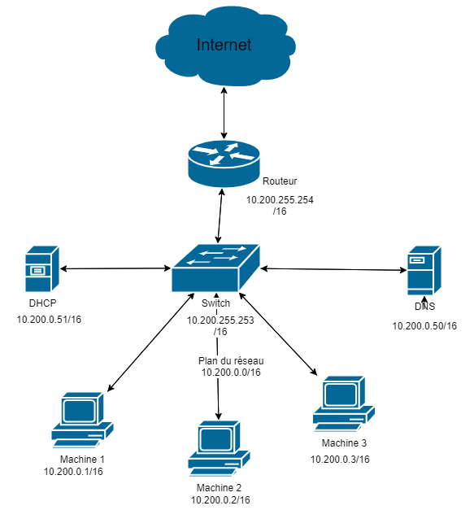)

>Voici ce à quoi peut ressembler le réseau mis en place dans l'entreprise.
### Ce qu'il faut retenir absolument :
 >  - ### c'est tout d'abord le **masque de sous-réseau** (ici, nous sommes en /16) pour pouvoir communiquer avec toutes les machines dans le réseau.
 >  - ### Il faut retenir également comment sont attribués les adresses pour chaque machines, par exemple en suivant la logique du schéma ci-desus, la machine 5 aura l'adresse : **100.200.0.5** .
 >  - ### Et enfin, prendre en compte l'adresse du serveur DNS pour pouvoir l'entrer dans notre configuration (Sinon le dhcp le fera automatiquement). Il faut **absolument** connaître l'adresse du switch pour pouvoir y configurer la route par défaut.

## [**Guide pour Linux**](#guide-de-dépannage-réseau-pour-machine-sous-linux)  
## [**Guide pour Windows**](#guide-de-dépannage-réseau-machine-windows)

# **Guide de dépannage réseau pour machine sous Linux**

## Ce guide vous permettra de résoudre quasiment tout les problèmes réseaux que vous pouvez rencontrer sur une machine Linux : 

 ## Sommaire :  
*  [**I - Vérification des branchements**](#i---vérifier-les-branchements-)
*  [**II - Vérification de la configuration réseau**](#ii---vérifier-la-configuration-réseau-)
*  [**III - Tester la configuration**](#iii---tester-)
----

 
**Tout d'abord, il est essentiel de comprendre avec quelle carte réseau (qu'on va appeler device tout au long du guide ) l'ordinateur gère le réseau. On va donc les lister :**  

	ip l 

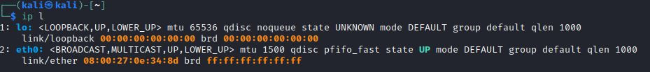
 > *L'interface **lo** est inutile car c'est l'adresse loopback, qui sert uniquement à communiquer avec nous même. L'interface réseau utilisée ici est donc la deuxième, nommé 'eth0'. Cependant cela peut être tout les noms possibles et différents, c'est à vous de faire en fonction.* 

 # I - Vérifier les branchements :
## 1. Visuellement :
   * Regarder si le câble n'est pas abimé
   * Et, si il est bien branché à l'ordinateur et à la prise murale 

## 2. Ou sinon :  
****
### Les deux commandes sont très similaires, on peut adapter en fonction de ce qui est installé sur la machine ou non. Elles servent à detecter logiciellement en temps réel si la carte réseau détecte bien qu'un cable réseau est branché. Nous avons des données en temps réel avec l'option -w (watch) et les résultats devraient donc varier au cours du temps si nous branchons ou débranchons le câble : 
		sudo mii-tool -w (device)

  
> *Il faut vérifier ici juste le **link**, si il est en ok, cela veut dire qu'il est branché. Sinon il faut rebrancher le câble ou le changer jusqu'à que le link soit en **ok*** 

-----

	
		sudo watch ethtool (device)
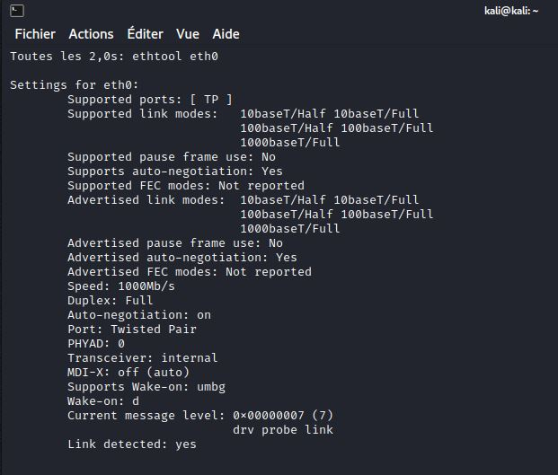  
> *Il faut vérifier ici juste le **link detected**, si il est en yes, cela veut dire qu'il est branché. Sinon il faut rebrancher le câble ou le changer jusqu'à que le link soit en **yes***

### Ces commandes sont très utiles pour savoir si le câble réseau est défectueux ou non. 

---

# II - Vérifier la configuration réseau : 
### *Avant toutes choses, les commandes qui seront données à la suite se feront avec (device) ou <nom device réseau>, mais vous devrez les remplacer vous mêmes avec le bon nom de la carte réseau utilisée, en pensant bien à ne pas mettre de parenthèses ou de quotes (<>).*
### Ensuite, nous vérifions si une carte réseau a été attribuée ou non sur le device réseau :  

	1 - ip a | grep <nom device réseau>

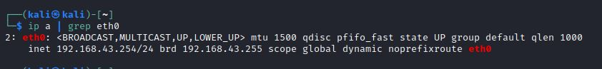
> *Il faut regarder ici si une adresse IP a été adressé sur l'interface réseau (à côté de **inet**) ainsi que l'état de la carte ( **UP ou DOWN**) à côté de **state***

 ## Si la carte est indiquée comme 'DOWN'  : 
### Cela signifie que la carte n'est pas allumée, il faut donc la réactiver **avant** de passer à l'étape de l'adressage réseau. Pour cela on utilise la commande suivante :
	sudo ip link set up dev (device)

# Pour attribuer une adresse IP à une interface réseau : 
## *Avant toutes actions, il est préférable de réinitialiser sa configuration réseau pour pouvoir en refaire une plus 'propre'. On utilisera les commandes suivantes :*  
	sudo ip route flush dev (device)  
### Qui permettra d'effacer toutes les routes configurés pour notre carte réseau    

	sudo ip a flush dev (device)  
### Et enfin on enlevera l'adressage pour pouvoir remettre un bon et ainsi pouvoir communiquer avec les autres machines du réseau. Ensuite, nous devons donc tout reconfigurer les paramètres sur la carte réseau : 
----
## Si l'entreprise possède un serveur dhcp, on utilise la commande :
	sudo dhclient (device)
> *Cela va faire une requête auprès du serveur DHCP mis en place pour qu'il nous fournisse directement une adresse IP en fonction du plan d'adressage.* 
 
 
 ## Si il n'y a pas de serveur DHCP :  
	ip a a IP/Masque dev (device)
> *Il faut bien faire en fonction de l'adressage mise en place dans l'entreprise et garder le **même masque de sous réseau** et le bon **IP***  

# Vérifier la route par défaut :
### Si vous avez une bonne IP configuré mais que vous n'avez pas la possibilité de communiquer avec le réseau LAN ou bien à l'extérieur, il s'agit probablement d'un problème de **route**.
> Une **route** est représenté par une **adresse IP** et c'est ce qui nous permet de configurer le chemin vers où la machine doit envoyer ses paquets pour communiquer avec les autres machines. On entre la commande :  
> 
	ip r
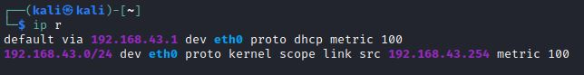
> *Vous devriez avoir des routes entrées par défaut lorsque nous utilisons le serveur DHCP, cependant lorsqu'on configure notre IP manuellement, il faut rajouter des routes et une par défaut, qui nous permettra d'accéder à Internet*
****
##  Si vous n'avez rien : 
*On supprime les routes entrées dans la machine avec la commande suivante pour éviter d'empieter avec les anciennes configurations :* 

	sudo route flush dev (device)
	
### Vous devez prendre connaissance du schéma du réseau établi dans l'entreprise et connaitre l'adresse du **switch** auquel est relié l'ordinateur.  
	ip route add default via IP dev (device)
> *La route par défaut doit être donc être l'IP du switch.*

# III - Tester :

## Une fois après avoir vérifier la configuration réseau de l'ordinateur et si le problème persiste, il faut voir où cela coince.

### On va donc voir si la machine peut communiquer à l'intérieur du réseau, ainsi qu'à l'extérieur du réseau. On va pour cela utiliser la commande ping :  
> L'option '-c 3' permet d'envoyer seulement 3 paquets vers l'adresse spécifiée. L'envoi d'un paquet ping se fait via le protocole ICMP et déroule de la manière suivante : 
> * On envoie un paquet ICMP Request, on interroge une machine,
> * Et si la machine reçoit le paquet, elle nous envoie en retour un paquet ICMP Reply comme réponse.   
Cette commande nous sert donc à vérifier si la communication entre deux machines fonctionne bien. 

	ping IP -c 3 

> On réalisera plusieurs tests : 
* Un ping vers une ip d'une machine **présente à l'intérieur** du réseau
* Un ping vers une adresse ip connue sur Internet, comme le dns de google ( 8.8.8.8 )
* Un ping vers un nom de domaine, comme google.com

##  Echec premier test :  
> ### Si le ping a échoué vers une machine présente dans le même réseau, **ET** que vous avez pourtant bien configurer votre machine dans la deuxième partie,
> ### Il s'agit probablement d'un problème soit au niveau du switch, du routeur ou bien que vous êtes bloqués par un pare-feu. Il peut s'agir dans de très rares cas que la machine que vous avez entré est configuré de sorte à ne jamais répondre aux requêtes, n'hésitez donc pas à en tester plusieurs. 

##  Echec deuxième test :  
> ### Si le ping a échoué vers une machine présente dans le même réseau, **ET** que vous avez pourtant bien configurer votre machine dans la deuxième partie,
> ### Il s'agit probablement d'un problème au niveau du routeur, il faut regarder si on a bien une route vers Internet, à l'extérieur du réseau.

##  Echec troisième test :  
> ### Si tout les tests ont fonctionnés, le problème viens de la configuration DNS de la machine.  Pour résoudre cela il faut entrer manuellement l'adresse du serveur dns qui sera utilisé pour convertir les noms symboliques en adresse ip : 
On se déplace dans le fichier de configuration qui se trouve dans le répertoire /etc : 

	sudo nano /etc/resolv.conf
Il devrait sûrement ne rien avoir écrit dans le fichier, sinon on peut effacer les configurations déjà rentrées dedans.
On rajoute en première ligne du fichier :   
	
	nameserver IP_SERVEUR_DNS
Et ensuite, pour sortir de nano :

	CTRL + x , Y ou O, ENTRER

-------
## **Après avoir suivi toutes les étapes, le problème réseau devrait être résolu. Mais même si après tout cela, on ne peut toujours pas accéder à Internet, le problème ne vient donc surement pas de l'ordinateur mais de la configuration réseau physique. Cela représente la configuration du switch, du routeur, du pare-feu, du câblage...**  
----

# Finalement, après avoir résolu les problèmes liés à la configuration réseau, il est essentiel de l'enregistrer de façon permanente :   
## Pour cela, vous devrez aller dans le fichier de configuration:
	nano /etc/netplan/01-netcfg.yaml  
## Et ensuite y entrer toute votre configuration telle qu'elle est sur la machine pour qu'elle puisse rester même après redémarrage de la machine : 
	network:
    version: 2
    ethernets:
        (device):
            addresses: [IP/MASQUE]
            gateway4: IP ROUTE PAR DEFAUT
            nameservers:
                addresses: [IP SERVEUR DNS]
            dhcp4: false ou true si il y a un serveur dhcp qui gère l'adressage en ipv4.
            dhcp6: false ou true si il y a un serveur dhcp qui gère l'adressage en ipv6.  
## L'indentation a un sens précis et il est obligatoire de le respecter tel qu'il est au dessus.
## Vous avez enfin fini le dépannage et la configuration de votre machine Linux ! 
-----

# Guide de dépannage réseau machine Windows

## Ce guide vous permettra de résoudre quasiment tout les problèmes réseaux que vous pouvez rencontrer sur une machine Windows : 
### Le guide qui va suivre utilise la ligne de commandes. Cependant, vous pouvez utiliser le guide pour utiliser une interface graphique ici : [**Configuration graphique Windows**](#configuration-réseau-windows-avec-une-interface-graphique-)

 ## Sommaire :  
*  [**I - Vérification des branchements**](#i---vérifier-les-branchements-)
*  [**II - Vérification de la configuration réseau**](#ii---vérifier-la-configuration-réseau-)
*  [**III - Tester la configuration**](#iii---tester-)
----

 
**Tout d'abord, il est essentiel de comprendre avec quelle carte réseau (qu'on va appeler device tout au long du guide ) l'ordinateur gère le réseau. On va donc les lister :** 

	ipconfig /all 
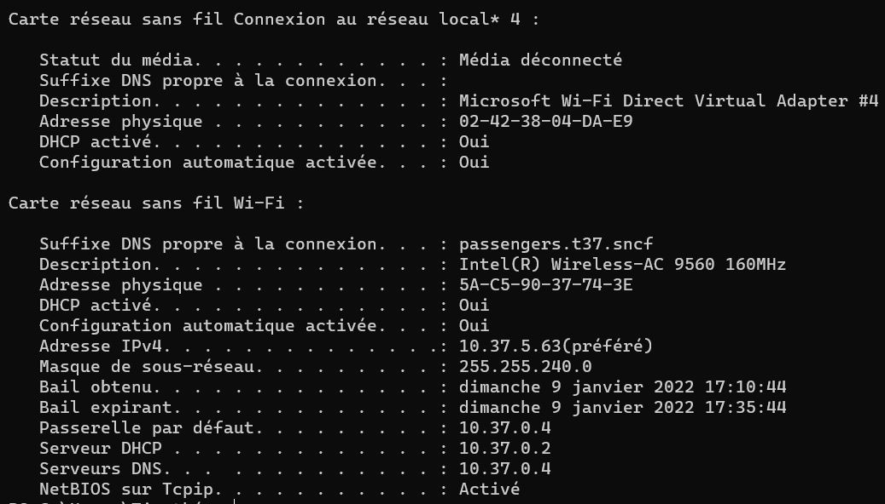
> On peut avoir plusieurs informations grâce à cette commande : 
> * Le statut de connexion de la carte "Média déconnecté" ou rien si allumé  
> * Le nom de la carte réseau qui va être utile pour la suite des commandes  
> * Savoir si le DHCP est activé, puis la configuration réseau sur la carte actuellement avec l'adresse du serveur DHCP pour effectuer la demande d'attribution d'adresse ip au serveur. Il y a l'adresse du serveur DNS utilisé, la passerelle par défaut, l'adresse ip attribué à notre machine, le masque de sous-réseau...
# I - Vérifier les branchements :
## 1. Visuellement :
   * Regarder si le câble n'est pas abimé
   * Et, si il est bien branché à l'ordinateur et à la prise murale 

## 2. Ou sinon :  
****
### Nous pouvons réutiliser la commande précédente, ça veut dire '**ipconfig /all**' pour vérifier l'état du banchement. Vous pouvez changer de câbles ou tenter de débrancher et rebrancher jusqu'à que votre carte réseau ne soit plus marquée comme 'Média Déconnecté'

> ### Exemple de message lorsqu'un câble est mal branché : 
>   
> ### Sinon lorsque bien branché :  
> 

---

# II - Vérifier la configuration réseau : 
### Ensuite, nous vérifions si une adresse ip a été attribuée ou non sur le device réseau :  

	ipconfig /all

> *Il faut regarder ici la bonne carte qui est utilisée. Si vous êtes connectés en ethernet alors il faut chercher **Carte réseau Ethernet**,sinon **Carte réseau sans fil Wi-Fi** et ensuite regarder la configurationde celle-ci.*

# Pour attribuer une adresse IP à une interface réseau : 
### Avant tout il est préférable de nettoyer la configuration réseau pour pouvoir en mettre une nouvelle. On utilise la commande suivante : 
	ipconfig /release
## Si l'entreprise possède un serveur dhcp, on utilise la commande :

	ipconfig /renew
> *Cela va faire une requête auprès du serveur DHCP mis en place pour qu'il nous fournisse directement une adresse IP en fonction du plan d'adressage.* 
 
 
 ## Si il n'y a pas de serveur DHCP :  
	netsh interface ip set address name="device" static IP masque_octal route_par_défaut
	
> *Il faut bien faire en fonction de l'adressage mise en place dans l'entreprise et garder le **même masque de sous réseau** et le bon **IP***  

# Vérifier la route par défaut :
### Si vous avez une bonne IP configuré mais que vous n'avez pas la possibilité de communiquer avec le réseau LAN ou bien à l'extérieur, il s'agit probablement d'un problème de **route**.
> Une **route** est représenté par une **adresse IP** et c'est ce qui nous permet de configurer le chemin vers où la machine doit envoyer ses paquets pour communiquer avec les autres machines. On entre la commande :  
> 
	route print
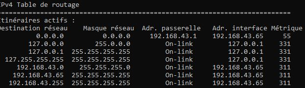
> *Vous devriez avoir des routes entrées par défaut lorsque nous utilisons le serveur DHCP, cependant lorsqu'on configure notre IP manuellement, il faut rajouter des routes et une par défaut, qui nous permettra d'accéder à Internet*
****
##  Si vous n'avez rien : 
*On supprime les routes entrées dans la machine avec la commande suivante pour éviter d'empieter avec les anciennes configurations :* 

	route -f
	
### Vous devez prendre connaissance du schéma du réseau établi dans l'entreprise et connaitre l'adresse du **switch** auquel est relié l'ordinateur.  
	route add -p [adresse ip destination] MASQUE [masque de l'adresse ip destination] [adresse ip de la gateway] METRIC 3 IF [numéro de la carte réseau à utiliser]
> *L'adresse ip de destination doit être donc être l'IP de la machine que vous souhaitez contacter et le masque doit être écrit en octal, donc de la manière suivante (si /16) : 255.255.0.0* . L'adresse IP de la gateway est la route par défaut, bien souvent c'est celle du switch ou du routeur principal, qui a soit ( dans la majorité du temps ) la **première** adresse IP du réseau (192.168.0.1) ou bien **l'avant dernière** (192.168.255.254) .

# III - Tester :

## Une fois après avoir vérifier la configuration réseau de l'ordinateur et si le problème persiste, il faut voir où cela coince.

### On va donc voir si la machine peut communiquer à l'intérieur du réseau, ainsi qu'à l'extérieur du réseau. On va pour cela utiliser la commande ping :  
>  L'envoi d'un paquet ping se fait via le protocole ICMP et déroule de la manière suivante : 
> * On envoie un paquet ICMP Request, on interroge une machine,
> * Et si la machine reçoit le paquet, elle nous envoie en retour un paquet ICMP Reply comme réponse.   
Cette commande nous sert donc à vérifier si la communication entre deux machines fonctionne bien. 

	ping IP ou nom symbolique (exemple : google.com) 
Exemple :   

	ping 8.8.8.8 
	ping google.com

> On réalisera plusieurs tests : 
* Un ping vers une ip d'une machine **présente à l'intérieur** du réseau (Par exemple en prenant [ le schéma du réseau présenté au début du document)](#vous-devez-prendre-connaissance-du-schéma-du-réseau-établi-dans-lentreprise-et-connaitre-ladresse-du-switch-auquel-est-relié-lordinateur), nous aurions pinger la machine 10.200.0.2 si nous étions la machine 1 ou 3.
* Un ping vers une adresse ip connue sur Internet, comme le dns de google ( 8.8.8.8 )
* Un ping vers un nom de domaine, comme google.com

## Finalement, un dernier test peut vous être utile : 
### C'est la commande tracert, qui permet d'envoyer des paquets ICMP avec un TTL allant de 1 à plusieurs dizaines, et ce dans le but de découvrir toutes les routes par lequel un paquet passe pour atteindre sa destination.
> **TTL = Time To Live, c'est une unité qui est rajoutée à chaque paquet envoyés pour ne pas qu'il se répande à l'infini. Dans son chemin vers le site que vous voulez visitez par exemple, il perdra une unité de TTL à chaque fois qu'il rencontre un device réseau (switch,routeur,serveurs..). C'est comme cela que tracert arrive à savoir tout les devices par lequel il passe car il envoie des paquets avec des TTL de plus en plus grand. On aura donc un retour sur le premier service rencontré,puis le deuxième avec un paquet d'un TTL de 2, puis ainsi de suite...**
### Cela nous permettra de voir si ce n'est pas une route qui coince la communication avec Internet.
## Mise en pratique : 
	tracert 8.8.8.8
## Exemple de réponse : 
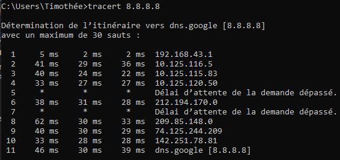  
>Les sauts sont en réalité les TTL, la commande fera émettre des paquets allant de 1 à 30 TTL maximum. 
### Si la commande parvient à arriver à la destination voulue (ici 8.8.8.8 représente le dns de google), alors tout marche.
>**Remarque** : Il n'est pas trop utile de s'intéresser aux délais d'attente de demande dépassés. L'essentiel ici est d'avoir une configuration qui fonctionne pour aller sur internet.  
##  Echec premier test :  
> ### Si le ping a échoué vers une machine présente dans le même réseau, **ET** que vous avez pourtant bien configurer votre machine dans la deuxième partie,
> ### Il s'agit probablement d'un problème soit au niveau du switch, du routeur ou bien que vous êtes bloqués par un pare-feu. Il peut s'agir dans de très rares cas que la machine que vous avez entré est configuré de sorte à ne jamais répondre aux requêtes, n'hésitez donc pas à en tester plusieurs. 

##  Echec deuxième test :  
> ### Si le ping a échoué vers une machine présente dans le même réseau, **ET** que vous avez pourtant bien configurer votre machine dans la deuxième partie,
> ### Il s'agit probablement d'un problème au niveau du routeur, il faut regarder si on a bien une route vers Internet, à l'extérieur du réseau.

##  Echec troisième test :  
> ### Si tout les tests ont fonctionnés, le problème viens de la configuration DNS de la machine.  Pour résoudre cela il faut entrer manuellement l'adresse du serveur dns qui sera utilisé pour convertir les noms symboliques en adresse ip : 
### Pour cela nous utiliserons la commande suivante : 
	netsh interface ip set dns name="device" static IP_DNS
### Il faut **remplacer** le **device** avec le nom de la carte réseau qui est utilisée et **IP_DNS** avec l'adresse ip du serveur dns.
Exemple :   

	netsh interface ip set dns name="Intel(R) Wireless-AC 9560 160MHz" static 10.200.0.51
##  Echec quatrième test :   
> ### Si vous avez un problème sur le test avec tracert, alors vous devrez configurer les bonnes routes comme indiqué plus haut dans le manuel. Sinon, il se peut que cela coince à une route dont vous ne pouvez rien, il faut alors attendre que le problème se résoude, vous pouvez essayer une autre adresse.

------
# Configuration réseau windows avec une interface graphique : 
## Windows propose également un outil de configuration réseau graphique, donc sans lignes de commandes. Il est souvent plus simple de comprendre et configurer le réseau de la machine sur celui-ci.

## Pour ouvrir l'utilitaire, il faut suivre les instructions suivantes : 
> * Il faut appuyer, **simultanément**, les touches **Windows** et **R**
> * Ecrire dans l'invite de commande qui s'est affichée : **control panel**  
>  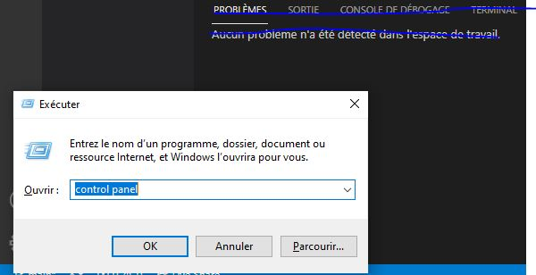  
> * Cliquez sur **Réseau et Internet**  
> 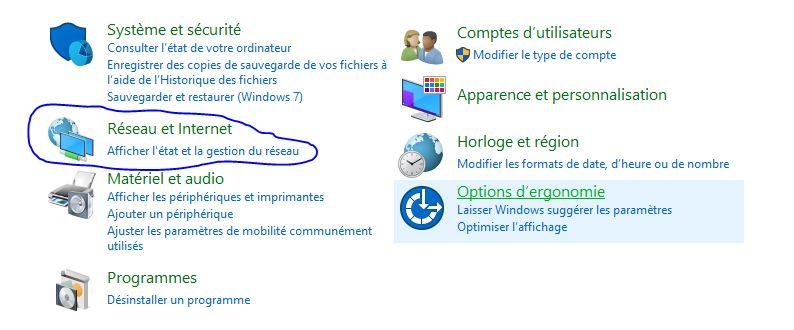
> * Cliquez sur **Centre Réseau et Partage**
> 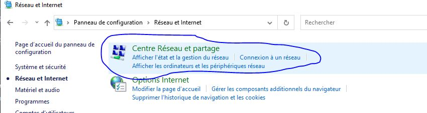
> * Cliquez sur **Modifier les paramètres de la carte**
> 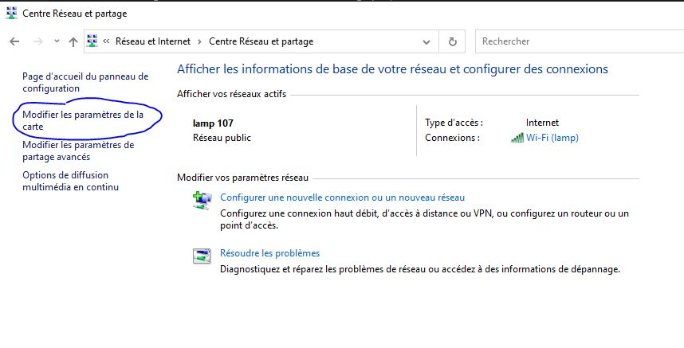
> *	Clique-droit sur la carte réseau qui est utilisé
> 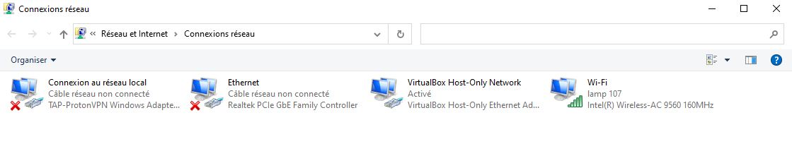
> * Cliquez sur **Propriétés**
> * Cliquez sur **Protocole Internet version 4 (TCP/IPv4)** et Cliquez sur **Propriétés**
> 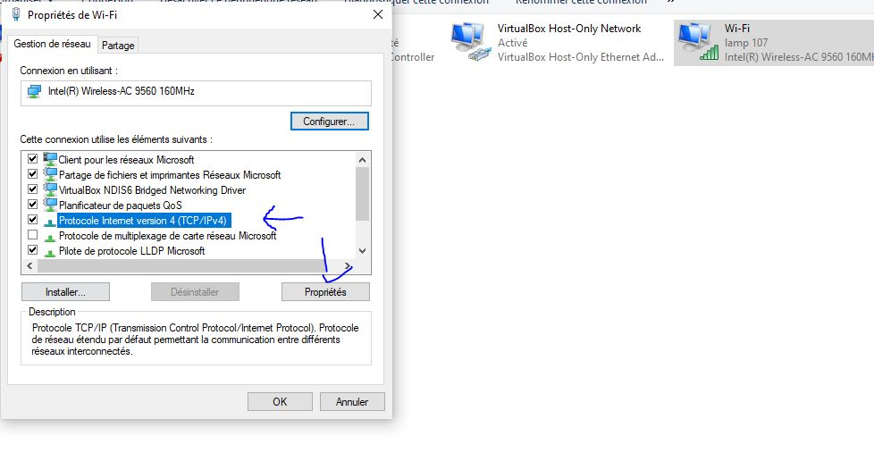
> * Finalement rentrer les différents paramètres requis pour la configuration :  
> 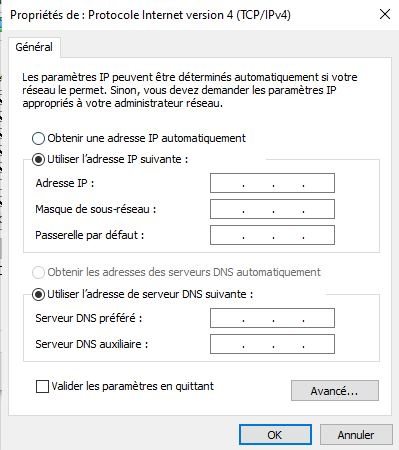
> ## *Remarque : pour le masque de sous-réseau, il faut l'écrire sous forme octale, soit pour un masque en /16 : 255.255.0.0*
> ## Pensez à appuyer sur **OK** pour sortir. 

-------
## **Après avoir suivi toutes les étapes, le problème réseau devrait être résolu. Mais même si après tout cela, on ne peut toujours pas accéder à Internet, le problème ne vient donc surement pas de l'ordinateur mais de la configuration réseau physique. Cela représente la configuration du switch, du routeur, du pare-feu, du câblage...**

		

