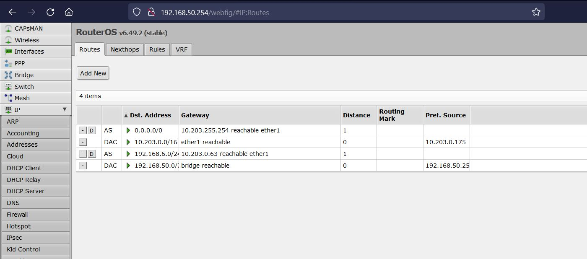

# Mise en place d'un réseau avec un routeur *Mikrotik* et de la communication entre plusieurs hôtes  
## Tout d'abord, avant de se lancer dans le concret, il est **essentiel** de faire un schéma du réseau qu'on souhaite mettre en place. Dans notre exemple nous utiliserons une architecture telle que ceci :  
----
  

----
## Pré-requis :
  * ### Un ordinateur minimum pour la configuration du routeur
  * ### Un routeur (référence utilisée ici : MikroTik Routerboard hEX)
  * ### Minimum deux câbles ethernet (Catégorie 5 ou +)
  * ### Un accès à internet ( Fournisseur d'accès à internet (Orange,Free,etc...) )

----
# I - Mise en place du routeur   

## Dans la boite se trouve d'une part le routeur, et dans la partie inférieure, sa prise d'alimentation :   

## L'appareil est très simple à comprendre : 
* ## Il est composé de 5 ports Ethernet ( Un dédié pour être relié au point d'accès à Internet et les autres pour la connexion des machines ( de 2 à 5 ) )
* ## Une entrée pour l'alimentation
* ## Un bouton pressoir pour le Reset
* ## Deux leds, une pour indiquer que le routeur est en marche (PWR) et un autre qui nous sera utile juste après (USR)
* ## Il y a également deux autres boutons sur le côté droit mais qu'on ne va pas parler ici. 

----
## La première étape consiste à réinitialiser le routeur de sa configuration actuelle, car, à moins qu'il soit neuf, on ne sait pas si il a déjà été configuré ou non par une personne tierce.  
----
### Pour cela, il faut une pointe fine qui peut atteindre le bouton pressoir au fond de la cavité nommée RST. Après avoir trouvé, suivez ces instructions :
> * **Rester** appuyer avec une fine pointe sur le bouton pressoir tout le long de la manoeuvre
> * **Brancher** l'alimentation sur une prise secteur standard et relier l'autre partie au routeur, **tout en gardant la pointe sur le bouton RST**
> * **Attendez** maintenant que le routeur s'allume
> * **Relâchez immédiatement** la pointe lorsque la led verte (au dessus de USR) commence à clignoter

### Après avoir fait cela, vous devez attendre quelques secondes et vous devriez normalement entendre 2-3 bips sonores au total.
---
# La seconde étape consiste à configurer le routeur : 
## Pour cela, il vous faut d'abord relier le routeur à un ordinateur, pour pouvoir accéder à son interface et le configurer.
---
### On reliera d'abord d'une part un câble Ethernet du **point d'accès réseau** jusqu'au port nommé **Internet** sur le routeur et puis un second qui part du **port 2** jusqu'à **votre ordinateur** comme ceci :    
  
### Ensuite, vous pouvez ouvrir un navigateur web et allez sur la page suivante : 
    http://192.168.88.1
### Vous tomberez immédiatement sur cette page suivante :     

> ### Il faudra donc changer de mot de passe comme indiqué. Il n'y a pas de mot de passe par défaut donc on laisse le champ '*Old Password*' vide. 
### Vous devriez arriver sur cette section :    

 ----
 # Ce qui va suivre sont les étapes les plus importantes, il est important de ne rien oublier et **surtout** d'adapter par rapport à votre réseau. 
## Les étapes à suivre :
> * Cochez '**Static**' dans la section ***Address Acquisition***
> * Entrez l'adresse ip que vous voulez en **respectant** le réseau mis en place du côté Internet, sur le schéma cela représente **l'adresse IP du routeur jusqu'au réseau de l'IUT**
> * Entrez le bon masque réseau, ici pour un /16 on prendra 255.255.0.0 pour communiquer sur le même réseau que l'IUT
> * Dans ***Gateway***, entrez l'adresse de la passerelle par défaut du réseau (de L'IUT dans notre cas soit : 10.203.255.254) 
> * Enfin, dans ***IP Address***, entrez une adresse IP qui sera affecté au routeur dans votre réseau local. ***Gardez une certaine logique***. On prendra ici **192.168.50.254**
> * Entrez le bon masque de réseau dans ***Network***, **on préférera un masque en /24** car notre réseau comportera très peu de machines donc il n'est pas utile de prendre un masque de sous-réseau plus petit.
> * Finalement, cochez, si ce n'est pas déjà fait par défaut, ***DHCP Server***, qui permettra de mettre en place au sein du routeur un service d'adressage automatique aux machines qu'on va lui relier.
> * La dernière étape est de remplir la plage d'adresse que le routeur va pouvoir adresser aux machines qui seront connectés. **Il faut faire très attention aux valeurs qu'on rentre**  
> Puisque nous avons choisi comme adresse locale de notre routeur 192.168.50.254, **il est donc important de ne pas avoir une machine avec la même adresse**. Il faut également **faire attention qu'il adressera des adresses avec le même réseau**.  
> **Pour résumer**, si notre réseau est en 192.168.50.0/24 et que notre routeur a l'adresse 192.168.50.254  
> **On entrera donc en plage d'ip** : 192.168.50.253-192.168.50.1  
> ***Il faut noter que la première adresse attribué par le routeur est l'adresse se trouvant à droite du tiret.***

## Une fois ces étapes terminés, vous pouvez appliquez les modifications et quitter la page en cliquant sur ce bouton :   
   

----

# Reconnexion au routeur
## Puisque vous venez de changer l'adresse locale de votre routeur, il est donc normal que la page de configuration sur laquelle vous êtes ne répondes plus car vous n'êtes plus sur le même réseau.

----
## Mais avant cela vous devez récupérer une adresse ip en utilisant le service DHCP que nous avons configuré précédemment : 
* ### Pour Linux :
        sudo ip a flush dev [carte réseau]  (Pour enlever la configuration mise sur votre carte réseau)
       
        sudo dhclient [carte réseau] (Pour faire une demande DHCP au service DHCP du routeur)

* ### Pour Windows ( CMD ou Powershell, avec les droits administrateurs ) : 
        ipconfig /release (Pour enlever la configuration mise sur votre carte réseau)

        ipconfig /renew (Pour faire une demande DHCP au service DHCP du routeur)

## Ensuite, vérifiez si vous avez bien reçu une adresse avec le bon masque de sous-réseau : 

* ### Pour Linux :
        ip a

* ### Pour Windows ( CMD ou Powershell, avec les droits administrateurs ) :
        ipconfig /all

> ## Vous remarquerez ici que le masque de sous-réseau n'est pas le bon. Il faudra donc ajouter manuellement une adresse avec un masque valide.

* ### Pour Linux :
        sudo ip a flush dev [carte réseau]  #(Pour enlever la configuration mise sur votre carte réseau)
       
        sudo ip a a [IP/masque] dev [carte réseau]  #(Pour attribuer à la carte réseau indiqué une adresse et son masque.)

* ### Pour Windows ( CMD ou Powershell, avec les droits administrateurs ) : 
        ipconfig /release (Pour enlever la configuration mise sur votre carte réseau)

        netsh interface ip set address name="carte-réseau" static [Ip de votre machine] 255.255.255.0 [IP de votre routeur (adresse locale)]

        qui donne : netsh interface ip set address name="Ethernet" static 192.168.50.1 255.255.255.0 192.168.50.254
----
# Configurer les routes pour communiquer avec un autre réseau
## Une fois tout cela fait, vous pouvez retournez sur un navigateur internet et aller sur l'adresse suivante : 
    http://[IP de votre routeur (adresse locale)] -> http://192.168.50.254
## Vous devriez arriver sur la page de configuration de tout à l'heure. Ensuite, il faut cliquer sur '***WebFig***' se trouvant en haut à droite de la plage et arriver sur cette page :    
 
## Comme indiqué, vous devez cliquer sur la section nommée '***IP***' et chercher ensuite la rubrique ***Addresses*** :    

### Vérifiez si vous avez bien une adresse pour le réseau inter-IUT sur l'interface **ether1** et que vous avez le bon réseau. (Ici, 10.203.50.1/16 et pour le réseau 10.203.0.0)
### Vérifiez également si vous avez l'adresse IP locale de votre routeur sur le bon réseau et l'interface **bridge**
-----
## Finalement pour la dernière étape de configuration, cliquez sur la rubrique ***Routes*** :    

## Avant de rajouter les routes, il est essentiel de comprendre que le réseau que nous souhaitons communiquer avec possède la même architecture que nous mais avec des adresses différentes : 

## Pour pouvoir communiquer avec l'**ordinateur 1** (192.168.40.1), il faut donc atteindre tout d'abord le **routeur mikrotik** (10.203.40.1), qui se chargera de transmettre le paquet à l'ordinateur 1.
## On retourne à notre onglet Routes :    

## On appuie ensuite sur le bouton ***Add New*** :  
> * ### Nous remplirons Dst. Address par l'adresse IP du réseau local que nous voulons contacter ( Si on se réfère au schéma précédent, ce sera 192.168.40.0/24 )
> * ### Egalement, dans la ***Gateway***, on mettra l'adresse IP du routeur MikroTik du réseau qu'on souhaite communiquer avec ( D'après le schéma précédent, ce sera 10.203.40.1/16 )
> * ### Finalement, on mettra en interface ***Ether1*** car c'est par ce port que passe tout les paquets de notre routeur.
-----
## Vous avez donc rajouter une bonne route qui fera le chemin nécessaire pour atteindre le réseau local de l'autre salle. Les paquets passeront par la **gateway du réseau de l'IUT (10.203.255.254)**, qui ira ensuite atteindre le **routeur mikrotik de l'autre salle (10.203.40.1)** et qui transfère finalement les paquets vers **l'ordinateur 1 (192.168.40.1)**
-----
# Tester la configuration : 
## Pour vérifier qu'il n'y a aucune erreur de configuration, nous allons tenter d'envoyer un paquet ICMP (ping) à l'ordinateur 1 pour voir si nous reçevons bien une réponse, qui attestera du fait qu'il a bien reçu notre paquet, et qui indiquera que la configuration est la bonne.
-----
## Cependant, avant cela, il est important de modifier les règles du Pare-Feu du routeur pour qu'il puisse accepter nos paquets entrants. Pour cela, nous allons dans l'onglet ***IP*** et il faut cliquer sur la rubrique ***Firewall***.
## Vous scrollez tout en bas de la page et vous désactiver, en appuyant sur le bouton ***D*** comme montrer ci-dessous :   
  

-----
# Vous pouvez donc essayer de lancer une requête ping vers l'ordinateur 1 avec la commande suivante (Peu importe la plateforme) :
    ping [IP ordinateur 1] -> ping 192.168.40.1
## Si il y a une erreur, essayer la commande suivante : 
    traceroute 192.168.40.1 #Linux
    tracert 192.168.40.1 #Windows
## Cela indiquera où le paquet coince. N'hésitez pas à relire les différentes étapes pour voir où vous vous êtes trompés. **Pensez à désactiver la règle du pare-feu comme indiqué au-dessus**

---- 
# La configuration est donc terminée. Du moins, du côté pratique. il est important de maintenant **sécuriser** le routeur sur Internet, il est très recommandé de suivre le guide suivant du constructeur pour ce faire :
 ## https://help.mikrotik.com/docs/display/ROS/First+Time+Configuration#FirstTimeConfiguration-ProtectingtheRouter

 ## https://help.mikrotik.com/docs/display/ROS/First+Time+Configuration#FirstTimeConfiguration-ProtectingtheClients